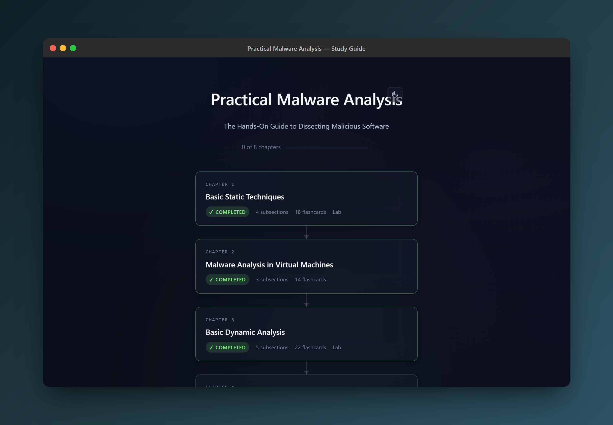

<div align="center">


# Coursesmith

**Turn a technical book into an interactive, TryHackMe-style study guide, from inside Claude Code.**

</div>

Coursesmith is a set of three [Claude Code](https://claude.com/claude-code) skills that turn a non-fiction book (PDF, DOCX, or EPUB) into a self-contained, browser-openable study guide: paraphrased notes, embedded quizzes, hands-on labs, optional Anki decks, and a generated certificate of completion. The output runs entirely from static files on disk, with no server, no build step, and no account.

It is built for **IT and cyber-security books** across the whole genre (Linux/shell, Windows/PowerShell/AD, Python offensive tooling, web security, exploit dev, cloud/DevSecOps, forensics, threat modelling), but works for any technical non-fiction.

<p align="center">
  
</p>

<p align="center"><em>A generated study guide roadmap, built from Coursesmith's real templates and styling.</em></p>

## Key Features

- **Whole-book pipeline**: point it at a PDF and get a clickable roadmap, per-chapter pages, and a completion certificate.
- **Faithful paraphrasing**: prose is condensed to 40 to 60% of the source; code, commands, paths, CVEs, and version numbers are preserved verbatim. No fabrication.
- **Interactive chapters**: multiple-choice and code-completion quizzes, progress ticks, and quiz state saved in your browser's `localStorage`.
- **Hands-on labs**: Jupyter notebooks for Python chapters, styled markdown lab guides for shell/Docker/CTF chapters, auto-selected per chapter.
- **Optional Anki**: opt-in 15 to 30 card cloze decks (`.apkg`) per chapter.
- **Generated certificate**: neon accent colour auto-derived from the book cover, author scraped from PDF metadata, rendered to PNG via headless Chromium. Dark and light themes.
- **Token-efficient rendering**: the model authors compact YAML/markdown; Python renderers expand it into themed HTML, saving roughly 70% of the tokens hand-written HTML would cost.
- **Resumable**: every chapter is written to disk before the next begins. Interrupt a long run and pick up later with "next chapter".

---

## Table of Contents

- [What this is (and isn't)](#what-this-is-and-isnt)
- [The three skills](#the-three-skills)
- [Prerequisites](#prerequisites)
- [Installation](#installation)
- [Quick Start](#quick-start)
- [Usage](#usage)
- [Output Structure](#output-structure)
- [How It Works (Architecture)](#how-it-works-architecture)
  - [The init → generate → cert pipeline](#the-init--generate--cert-pipeline)
  - [Reading the book off disk](#reading-the-book-off-disk)
  - [The render pipeline](#the-render-pipeline)
  - [manifest.json schema](#manifestjson-schema)
  - [chapter.yaml authoring schema](#chapteryaml-authoring-schema)
  - [Markdown shortcodes](#markdown-shortcodes)
- [Scripts Reference](#scripts-reference)
- [Repository Layout](#repository-layout)
- [Configuration](#configuration)
- [Running Outside Claude Code](#running-outside-claude-code)
- [Troubleshooting](#troubleshooting)
- [Design Docs](#design-docs)
- [Contributing](#contributing)
- [Licence](#licence)

---

## What this is (and isn't)

Coursesmith is **not an application you run**: it is a set of three Claude Code skills. A skill is a folder containing a `SKILL.md` instruction file plus bundled templates and Python scripts. You install the folders where Claude Code can find them, then drive the workflow with slash commands in a Claude Code session. Claude reads the book, authors the content, and runs the bundled renderers; the renderers produce the static study-guide site.

The **study guide it produces** is a plain folder of HTML/CSS/JS. Open `index.html` in any browser: no web server, database, or deployment required.

> **Copyright note.** Output is paraphrased educational notes for your own personal study, not redistribution. Coursesmith never reproduces long verbatim passages from the source. Don't republish generated guides for copyrighted books.

---

## The three skills

### `coursesmith-init`: one-time setup per book

Reads the source file, extracts the table of contents, strips front matter (preface, foreword, acknowledgments), and derives each chapter's page range. It verifies the PDF page offset automatically by checking the first and last chapters' opening pages against their titles, then scaffolds the course folder: roadmap `index.html`, `manifest.json`, shared `assets/`, and a clickable placeholder page for every chapter. For PDFs it also does a one-time full-book conversion to markdown (`source.md`) so later sessions never re-spawn a JVM. Hands off to `coursesmith-generate` for chapter 1 automatically.

- **Default flow is autonomous**: it prints the derived chapter list for transparency and proceeds without a confirmation prompt.
- **`--step`** forces an interactive confirm/edit of the chapter list before scaffolding.
- It pauses on its own only when the page offset can't be verified, the one case a human genuinely needs to weigh in.
- It refuses to overwrite an existing study-guide folder.

Run this **once per book**.

### `coursesmith-generate`: the repeat action

Generates (or refines) chapter content inside a folder that `init` already scaffolded. Per chapter it produces:

- Paraphrased study notes (40 to 60% of source length), authored as `chapter.yaml`.
- 3 to 5 question quizzes per subsection (multiple-choice and short-answer), embedded in the page.
- Extracted code examples as standalone files, referenced (never pasted) from the notes.
- A hands-on lab: Jupyter notebook, styled markdown guide, or none for purely conceptual chapters.
- An **optional** 15 to 30 card Anki cloze deck (you're asked per chapter; default is no).

**Modes:**

| Mode | Trigger | Behaviour |
|---|---|---|
| Next chapter (default) | "next chapter", "carry on" | Generates the lowest-numbered `pending` chapter. |
| Named chapter | "do chapter 5" | Generates that specific chapter. |
| Refine | "the quiz for chapter 3 is too easy", "lab for 7 should use Docker" | Regenerates only the affected component. |
| Loop the rest | "do all the remaining chapters now" | Loops every `pending` chapter; stops cleanly if context runs tight. |

Requires a folder already set up by `coursesmith-init`. If no `manifest.json` is found, it stops and tells you to run init first.

### `coursesmith-cert`: certificate of completion

Run once every chapter is `status: "ready"`. Refuses (and lists offenders) if any chapter is still pending. Prompts for the recipient name and theme (dark/light), auto-derives a neon accent from the book cover (OKLCH), scrapes the author from PDF metadata or the title page, renders the bundled HTML template through headless Chromium at 1200x800, writes `certificate.png` into the folder, and re-renders the roadmap to pin a link to it. Cert IDs are deterministic (`CSM-{hash}-{year}`).

---

## Prerequisites

| Requirement | Needed for | Notes |
|---|---|---|
| **Claude Code** with skill support | Everything | The skills run inside a Claude Code session. |
| **Python 3.10+** | All renderers and scripts | Scripts auto-install their own Python dependencies (`pyyaml`, `markdown`, `genanki`, `playwright`, `Pillow`, `pypdf`, `opendataloader-pdf`) on first use. |
| **Java 11+** | One-time PDF-to-markdown conversion at init (`opendataloader-pdf`) | Only needed during `coursesmith-init`. Without it, generation falls back to `pdftotext`/`pypdf` (functional, slower, lower quality). Install [Eclipse Temurin 21 LTS](https://adoptium.net). |
| **poppler-utils** (`pdftotext`, `pdfimages`, `pdfinfo`) | PDF text/image extraction and the Java-less fallback | `apt install poppler-utils` / `brew install poppler`. |
| **Chromium** | Certificate rendering | Auto-installed by Playwright on first cert render. If offline, run `python -m playwright install chromium`. |

> The init skill auto-detects a Java 11+ install on Windows, macOS, and Linux even when an older Java stub shadows it on `PATH`. If detection fails, it tells you and continues with the fallback rather than blocking.

---

## Installation

Coursesmith is a set of three skill folders: `coursesmith-init/`, `coursesmith-generate/`, and `coursesmith-cert/`.

### Option A: Claude Code skill installer (recommended)

If you use a skill installer/marketplace, point it at this repository and install the three `coursesmith-*` skills.

### Option B: manual

Copy the three skill folders into your Claude Code skills directory:

```bash
# User-level skills (available in every project)
cp -r coursesmith-init coursesmith-generate coursesmith-cert ~/.claude/skills/

# Or project-level skills (available only in this project)
mkdir -p .claude/skills
cp -r coursesmith-init coursesmith-generate coursesmith-cert .claude/skills/
```

On Windows (PowerShell):

```powershell
Copy-Item -Recurse coursesmith-init,coursesmith-generate,coursesmith-cert "$env:USERPROFILE\.claude\skills\"
```

Restart Claude Code (or start a new session) so it picks up the skills. Verify they're available by typing `/` and looking for `coursesmith-init`, `coursesmith-generate`, and `coursesmith-cert`.

### Optional: pre-allow the PDF tools

To skip permission prompts for the PDF utilities, add them to your project's `.claude/settings.json` (this repo ships with this already):

```json
{
  "permissions": {
    "allow": [
      "Bash(pdftotext *)",
      "Bash(pdfinfo *)",
      "Bash(pdfimages *)"
    ]
  }
}
```

---

## Quick Start

In a Claude Code session, from any directory:

```text
/coursesmith-init ~/books/black-hat-python.pdf
```

That scaffolds `~/books/study-guide-black-hat-python-3rd-ed/` and immediately generates chapter 1. Then, in the same or a later session:

```text
/coursesmith-generate              # next pending chapter
/coursesmith-generate chapter 5    # a specific chapter
/coursesmith-generate do all the remaining chapters
/coursesmith-cert                  # once every chapter is ready
```

Open `index.html` in the study-guide folder to see the roadmap. Click any chapter to study it.

---

## Usage

### Starting a course

```text
/coursesmith-init path/to/book.pdf
```

Natural-language invocations work too: "turn this book into a study guide", "start a course from this PDF", "make me a TryHackMe-style course from book.pdf".

- **Scaffold only** (no chapter 1): add "setup only" / "scaffold only" / "don't do chapter 1 yet".
- **Review the chapter list first**: pass `--step` or say "let me check the chapters first".
- **Custom output folder**: name a target path in the prompt; otherwise it defaults to a `study-guide-{slug}` subfolder beside the source file.

### Generating chapters

```text
/coursesmith-generate                          # lowest pending chapter
/coursesmith-generate chapter 7                 # specific chapter
/coursesmith-generate carry on the course       # next pending
/coursesmith-generate do the whole thing now    # loop all remaining
```

### Refining a chapter

Refine mode regenerates only the component you mention and leaves the rest untouched:

```text
/coursesmith-generate the quiz for chapter 3 is too easy
/coursesmith-generate rewrite chapter 2's notes more concisely
/coursesmith-generate the lab for chapter 7 should use Docker
/coursesmith-generate add more Anki cards for chapter 5
```

### Generating the certificate

```text
/coursesmith-cert
/coursesmith-cert make me the cert, name "Jane Doe", light theme
/coursesmith-cert regenerate with a different name
```

Optional cert tweaks: a specific accent hex (`--accent "#ff4136"`) or a custom completion date, just ask in natural language.

---

## Output Structure

A fully generated guide on disk:

```text
study-guide-{book-slug}/
├── index.html                     # Roadmap landing page; re-rendered after every chapter
├── manifest.json                  # Book metadata, chapter list, status, certificate block
├── source.md                      # One-time full-book markdown (PDFs only; null otherwise)
├── assets/
│   ├── styles.css                 # Shared glassmorphic theme
│   └── script.js                  # Progress tracking + quiz logic (localStorage)
├── chapters/
│   └── NN-chapter-slug/           # NN zero-padded
│       ├── chapter.yaml           # Authored source: intro, subsections, quizzes
│       ├── index.html             # Rendered from chapter.yaml
│       ├── anki-deck.apkg         # Only if you opted in to Anki
│       ├── code-examples/         # Only if the chapter has code
│       │   ├── index.html         # Themed listing of every script
│       │   ├── 01-hello.py
│       │   └── ...
│       ├── lab.ipynb              # Jupyter lab  ─┐ one of these,
│       ├── lab-guide.md          # Markdown lab  ─┤ or neither
│       └── lab.html              # Rendered markdown lab ─┘ (for lab-guide.md)
└── certificate.png                # Generated by coursesmith-cert after all chapters complete
```

A chapter has `lab.ipynb` **or** `lab-guide.md` **or** neither, never both. The study guide is fully static: open `index.html` directly from the filesystem.

---

## How It Works (Architecture)

### The init → generate → cert pipeline

```text
            ┌─────────────────────┐
 book.pdf → │  coursesmith-init   │  reads ToC, derives page ranges, verifies
            │  (once per book)    │  offset, converts PDF→source.md, scaffolds
            └──────────┬──────────┘  folder, hands off chapter 1
                       │
                       ▼
            ┌─────────────────────┐
            │ coursesmith-generate│  per chapter: slice pages → paraphrase →
            │ (every session)     │  quizzes → code files → lab → (opt) Anki →
            └──────────┬──────────┘  render HTML → update manifest + roadmap
                       │  (repeat until every chapter is "ready")
                       ▼
            ┌─────────────────────┐
            │  coursesmith-cert   │  verify all ready → derive accent + author →
            │  (once at the end)  │  render certificate.png → link from roadmap
            └─────────────────────┘
```

State lives in two places: `manifest.json` (the source of truth for chapter status and metadata) and the on-disk files themselves (the renderers detect resources by their presence). Because every chapter is committed to disk before the next starts, the workflow is fully resumable across sessions.

### Reading the book off disk

The model never loads the whole book into context. It reads only the pages a chapter needs:

1. **Primary path (fast, no JVM):** if `manifest.source_md` is set, slice the chapter's text from `source.md` using the `<!-- Page N -->` markers embedded at init time.
2. **Fallback path:** if `source_md` is null/missing or the source is DOCX/EPUB, extract on demand, using `pdftotext -f {start} -l {end}` for PDFs, or splitting by chapter heading for DOCX/EPUB.

Figures are pulled with `pdfimages` only when a chapter needs them.

### The render pipeline

The model authors compact source files; **Python renderers** turn them into themed HTML. This is the core token-saving design: the model writes YAML and markdown, never hand-written HTML.

| Author writes | Renderer | Produces |
|---|---|---|
| `chapter.yaml` | `render_chapter.py` | `index.html` (notes, quizzes, sidebar, resource cards, selective Prism includes, prev/next nav) |
| `lab-guide.md` | `render_lab.py` | `lab.html` (themed lab page) |
| files in `code-examples/` | `render_code_index.py` | `code-examples/index.html` (themed listing) |
| `cards.json` (opt-in) | `generate_anki.py` | `anki-deck.apkg` |
| `manifest.json` | (re-rendered by the above) | roadmap `index.html` |
| `certificate.html` template | `render_certificate.py` | `certificate.png` |

Renderers auto-detect what to include: Prism syntax-highlighting components load only for languages actually used on the page; resource cards (Anki / lab / code) appear only when the corresponding files exist on disk.

### manifest.json schema

The single source of truth. Abbreviated:

```jsonc
{
  "book": {
    "title": "Book title",
    "subtitle": "Optional one-line description",
    "author": "Author name",
    "publisher": "No Starch Press",
    "edition": "3rd",
    "year": 2025,
    "slug": "book-title-3rd-ed"
  },
  "source_pdf": "/abs/path/book.pdf",     // absolute; read on demand for extraction
  "output_dir": "/abs/path/study-guide-…",
  "source_md":  "/abs/path/…/source.md",  // null if Java unavailable or non-PDF source
  "generated_at": "2026-05-07T00:00:00Z",
  "last_modified": "2026-05-07T00:00:00Z",
  "chapters": [
    {
      "number": 1,
      "title": "Chapter title from the ToC",
      "slug": "01-introduction",
      "directory": "01-introduction",
      "status": "pending",                 // "pending" → "ready"
      "page_start": 0,                     // 1-based inclusive PDF pages (0 for DOCX/EPUB)
      "page_end": 0,
      "subsection_count": 0,
      "card_count": 0,                     // 0 if Anki was declined
      "lab_type": null,                    // "jupyter" | "shell" | "windows" | "network" | "pentest" | null
      "subsections": [],                   // [{id, title}] once generated
      "last_modified": null
    }
  ]
  // coursesmith-cert later adds a "certificate" block:
  // { name, id, accent, accent_source, theme, author_used, path, generated_at }
}
```

### chapter.yaml authoring schema

The model writes this per chapter; `render_chapter.py` expands it. Full schema in `coursesmith-generate/templates/chapter.yaml`:

```yaml
intro: |
  One-paragraph framing in markdown.

subsections:
  - id: short-kebab-case-id
    title: Section title
    body: |
      Markdown body: paragraphs, lists, fenced code blocks, pipe tables,
      and the shortcodes below.
    quiz:
      - mcq: Question text?
        options: [A, B, C, D]
        correct: 2            # 1-indexed, or a letter "a"/"b"/"c"/"d"
        explain: Why the correct answer is correct.
      - short: Question text?
        answer: Model answer text.
```

### Markdown shortcodes

Inside `chapter.yaml` bodies, beyond standard CommonMark (fenced code, pipe tables, lists):

**Block-level** (own line, blank lines around):

- `!codefile <relative-path>`: inlines a code file as a Prism-highlighted block with a "View full file" link. Always reference code this way; never paste code into the YAML.
- `!figure <path> "<caption>"`: embeds an image with a caption.

**Block fences** (paired `:::`):

- `:::note` … `:::`: informational callout. `:::note warning|tip|danger` for yellow/green/red variants.
- `:::terminal [shell]` … `:::`: styled terminal session. Optional `bash` (default), `powershell`, `batch`, `python`, `sql`, etc.

**Inline:**

- `!cve CVE-2024-1234`: links to the NVD page for that CVE.
- `!mitre T1059.001`: links to the MITRE ATT&CK technique (supports parent and sub-techniques).

Code examples are preserved **verbatim**: the renderer never refactors or modernises the source's code, since the reader's mental model must match the book.

---

## Scripts Reference

All scripts auto-install their own Python dependencies on first run.

| Script | Skill | Purpose |
|---|---|---|
| `scripts/package_guide.py` | init | Zips the study-guide folder (for the claude.ai/Cowork fallback or on request). |
| `scripts/render_chapter.py` | generate | Renders `chapter.yaml` → chapter `index.html`. Handles shortcodes, quizzes, sidebar, Prism includes, resource cards, nav. |
| `scripts/render_lab.py` | generate | Renders `lab-guide.md` → themed `lab.html`. |
| `scripts/render_code_index.py` | generate | Renders `code-examples/index.html` listing every script. |
| `scripts/generate_anki.py` | generate | `genanki` wrapper; builds a `.apkg` cloze deck from `cards.json` (opt-in only). |
| `scripts/render_certificate.py` | cert | Orchestrates accent/author extraction, token substitution, Chromium screenshot, manifest + roadmap update. |
| `scripts/extract_accent.py` | cert | Cover image → neon hex (OKLCH), with a light variant. |
| `scripts/extract_author.py` | cert | PDF metadata → title-page scrape, with a blacklist. |

Example: render a chapter manually (Claude does this for you):

```bash
python coursesmith-generate/scripts/render_chapter.py \
  --source   /path/study-guide-x/chapters/03-slug/chapter.yaml \
  --manifest /path/study-guide-x/manifest.json \
  --output   /path/study-guide-x/chapters/03-slug/index.html
```

---

## Repository Layout

```text
.
├── README.md
├── .gitignore
├── .claude/
│   └── settings.json              # Pre-allows pdftotext/pdfinfo/pdfimages
├── coursesmith-init/
│   ├── SKILL.md
│   ├── references/non-claude-code-fallback.md
│   ├── scripts/package_guide.py
│   └── templates/                 # manifest.json, roadmap.html, chapter-placeholder.html,
│                                  # roadmap-certificate-card.html, styles.css, script.js
├── coursesmith-generate/
│   ├── SKILL.md
│   ├── references/                # paraphrasing-rules.md, lab-decisions.md, anki-card-rules.md
│   ├── scripts/                   # render_chapter.py, render_lab.py, render_code_index.py, generate_anki.py
│   └── templates/                 # chapter.yaml, lab.ipynb, lab-guide.md
├── coursesmith-cert/
│   ├── SKILL.md
│   ├── references/neonification-rules.md
│   ├── scripts/                   # render_certificate.py, extract_accent.py, extract_author.py
│   └── templates/certificate.html
└── docs/
    ├── assets/                    # README images (e.g. coursesmith-mockup.png)
    └── specs/                     # design documents
```

---

## Configuration

There is no app config file. Behaviour is controlled by:

- **The slash command / natural-language prompt**: mode (next/named/refine/loop), output folder, `--step`, "setup only", cert name/theme/accent/date.
- **`manifest.json`**: chapter status, page ranges, and metadata. Hand-editable if you need to merge/split/skip chapters or correct a page offset, though re-running the relevant skill is usually easier.
- **`.claude/settings.json`**: pre-allowed Bash tools (the PDF utilities), so Claude doesn't prompt for permission each time.
- **Templates**: edit `templates/styles.css` / `templates/certificate.html` to change the look; the renderers only do string substitution, so design changes live in the templates.

---

## Running Outside Claude Code

The skills assume a filesystem that persists between sessions. On claude.ai or Cowork without persistent storage, use the zip-handover fallback: the folder is zipped to `/mnt/user-data/outputs/` at the end of a session and you re-upload the zip next time. Details in `coursesmith-init/references/non-claude-code-fallback.md`. Build a zip on demand with:

```bash
python coursesmith-init/scripts/package_guide.py \
  --source /path/study-guide-x \
  --output /path/study-guide-x.zip
```

---

## Troubleshooting

### "No study guide folder found here" (generate/cert)

`coursesmith-generate` and `coursesmith-cert` require a `manifest.json` that `coursesmith-init` creates. Run `/coursesmith-init path/to/book.pdf` first, or point the skill at the correct folder.

### "A study guide already exists" (init)

`coursesmith-init` refuses to overwrite. Use `coursesmith-generate` to add the next chapter, or delete/rename the existing folder if you really want to start over.

### PDF-to-markdown conversion failed at init

Almost always a missing or too-old Java. Install **Java 11+** ([Temurin](https://adoptium.net)) and re-run init. You can proceed without it: generation falls back to `pdftotext`/`pypdf` per chapter (slower, lower quality) and `source_md` is set to `null`.

### `pdftotext: command not found`

Install poppler-utils: `apt install poppler-utils` (Debian/Ubuntu) or `brew install poppler` (macOS). Acceptable substitutes the scripts can use: `pypdf`, `pdfplumber`.

### Chapter pages are wrong / off by a few

The PDF page offset (printed page vs PDF page) was likely mis-derived. Fix `page_start`/`page_end` in `manifest.json` for the affected chapters and re-run `/coursesmith-generate chapter N`. Running init with `--step` lets you review and correct the offset up front.

### OCR'd PDF produces gibberish

If a scanned PDF's text layer is garbage for a chapter, generation stops rather than producing notes from broken text. OCR the PDF first (e.g. `ocrmypdf`) and re-run init against the cleaned file.

### Certificate render fails: Chromium not installed

Playwright needs Chromium once. If the auto-install fails (offline/proxy), run:

```bash
python -m playwright install chromium
```

then re-invoke `/coursesmith-cert`.

### Certificate accent colour looks wrong

The cover-derived colour can misfire on very dark covers. Re-run the cert with an explicit accent, e.g. "regenerate the cert with accent #ff4136".

### "Some chapters are still pending" (cert)

`coursesmith-cert` won't produce a partial-completion certificate. Finish the listed chapters with `coursesmith-generate`, then retry.

### Context runs out during a "do all chapters" loop

Expected on long books. The loop stops cleanly with every finished chapter saved to disk. Start a fresh session and say "next chapter" to continue from where it stopped.

---

## Design Docs

Background and decisions live in `docs/specs/`:

- `docs/specs/2026-05-26-coursesmith-skill-split-design.md`: why the workflow is split into init / generate / cert.
- `docs/specs/2026-05-26-certificate-and-light-mode-design.md`: the certificate skill and light-mode theme design.

---

## Contributing

Contributions are welcome. When editing a skill, keep these invariants intact:

- **No fabrication, faithful paraphrasing.** Prose may be condensed; code, commands, paths, IDs, and version numbers stay verbatim.
- **Authors write source, renderers write HTML.** Never hand-author chapter HTML; change `chapter.yaml` (or the templates) and re-run the renderer.
- **British English, no AI tells.** No em dashes, no emojis (unless the source uses them), plain technical prose.
- Scripts should keep auto-installing their own dependencies so the skills work on a fresh machine.

The reference files (`coursesmith-generate/references/*.md`) define the paraphrasing, lab-selection, and Anki rules, read them before changing generation behaviour.

## Licence

No licence file is currently included in this repository. Until one is added, all rights are reserved by the authors. Generated study guides are for personal study only; do not redistribute content derived from copyrighted books.
